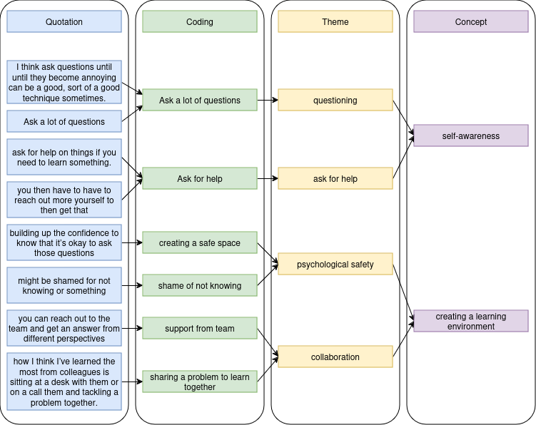

+++
title = "Interviewing software engineers about learning"
date = 2023-03-19
description = "What I have learned interviewing software engineers about learning for my MBA"
[taxonomies]
tags = ["MBA", "Learning"]
+++

I have worked in software engineering for 18 years, and as a manager for 12 years. Learning and development for my team is one of my biggest drivers, and seeing people progress gives me the greatest satisfaction. It is important to me to understand this topic better so that I can make improvements in the places I work.

For my MBA, I wrote a longer assignment (7600 words) on "How to support learning and development for remote software engineers".
Although I didn't find any silver bullet to make this easier, I learned a lot from the process of doing the study.

I interviewed 5 software engineers of varying experience. These interviews were semi-structured interviews, which means that I asked a set of questions, but the questions were open questions trying to not force the participant down a particular route of answering.

The engineers that I've interviewed span from 5 to 15 years of software engineering experience, across multiple workplaces.

# The questions

## Is learning important in software engineering?
I asked this as an easy starter question, and to lay the groundwork for how the participants felt about learning.

## Describe the way in which you learn.
This was one of the more meaty questions - I wanted to understand on an individual basis how the engineer went about learning. Using "describe" in an interview is usually a way to get good detailed answers.

## Has the way that you learn changed over your career?
This questions does quite a lot of lifting - I'm looking for:
- differences based on seniority
- differences based on remote / in-person
- differences based on the type of organisation that the participant was working for

## How do you know when you've really understood something you have learned?
This is a hard question, that a lot of academics and learning professionals struggle to answer, and I'm interested in what the engineers think about this.

## What are the best ways to learn from your colleagues?
Collaboration always seems to be a big part of learning for me, and I'm interested in how this is answered. I'm also looking for some tools in this answer that might help people learn better together.

## Do you feel you are well supported in learning by your peers?
This is similar in purpose to the previous question, but aiming to grasp at any feelings.

## When asking these questions about how software engineers can learn better from their colleagues in a remote environment, what questions should I be asking to understand the topic better?
This question I struggled to phrase correctly, and was the one that caused me the most problems explaining in the interview - if I do this process again, what questions should I ask to the next cohort of interviewees to get better quality answers?

# Results

I used thematic analysis1 to extract meaning from the discussions of the engineers. The flow shown below was based on a later paper2 by Naeem et al.

I grouped the analysed themes together and displayed them on a mindmap.


mindmap
  root((Themes))
    Types of learning
      Learning by doing
      Other Learning Types
        Reading
        Structured learning
        Videos
        Coaching
          In person
          Artificial Intelligence
    Creating a learning environment
      Psychological safety
      Removing barriers
        Physical
        Other
        Cultural
      Building a community
      Reducing distractions
      Collaboration & communication
      Supporting remote workers
    Reinforcement
      Teaching others to measure learning
      Feedback
    Importance of learning
      Continuous change
      Patterns
      High degree of complexity
      Finding deeper understanding
    Self-awareness
      Asking for help
      Understanding yourself
      Understanding how others can help


Then finally showed the more simple concepts on their own:


mindmap
  root((Concepts))
    Types of learning
    Creating a learning environment
    Reinforcement
    Importance of learning
    Self-awareness


I created a quick graph to look at the relative frequency that the participants were mentioning the different concepts:


xychart-beta
    title "Concept mentions by participants"
    x-axis ["Types of learning", Environment, Reinforcement, "Learning importance", Self-awareness]
    y-axis "Number of mentions" 0 --> 75
    bar [40, 63, 19, 19, 27]


# Interesting results for further research

All five particpants said that learning by doing was their primary method of learning. They experimented, tried things, and tested it out themselves.

The literature didn't have any clear examples of applying techniques to learning by doing - no methodologies that I could find to approach this, and teach it to new engineers.

# References

1: Victoria Clarke & Virginia Braun (2017) Thematic analysis, The Journal of Positive Psychology, 12:3, 297-298, DOI: 10.1080/17439760.2016.1262613 

2: Naeem, M., Ozuem, W., Howell, K., & Ranfagni, S. (2023). A Step-by-Step Process of Thematic Analysis to Develop a Conceptual Model in Qualitative Research. International Journal of Qualitative Methods, 22. https://doi.org/10.1177/16094069231205789